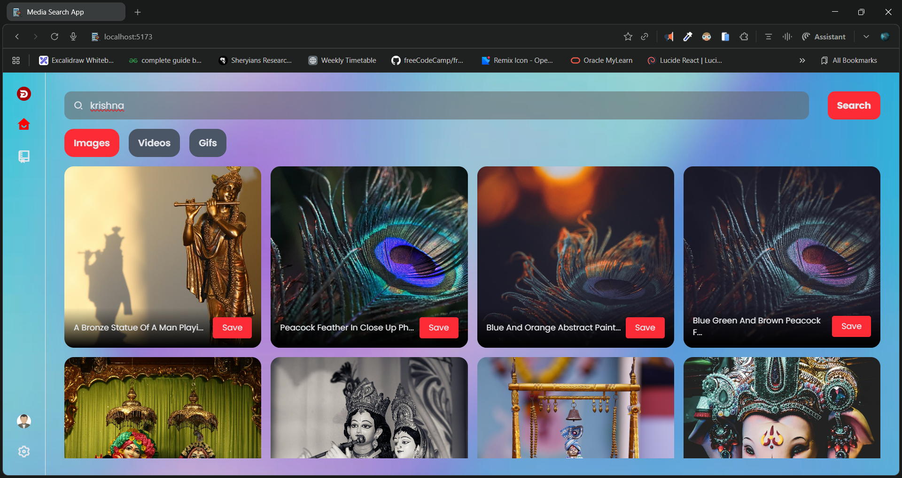
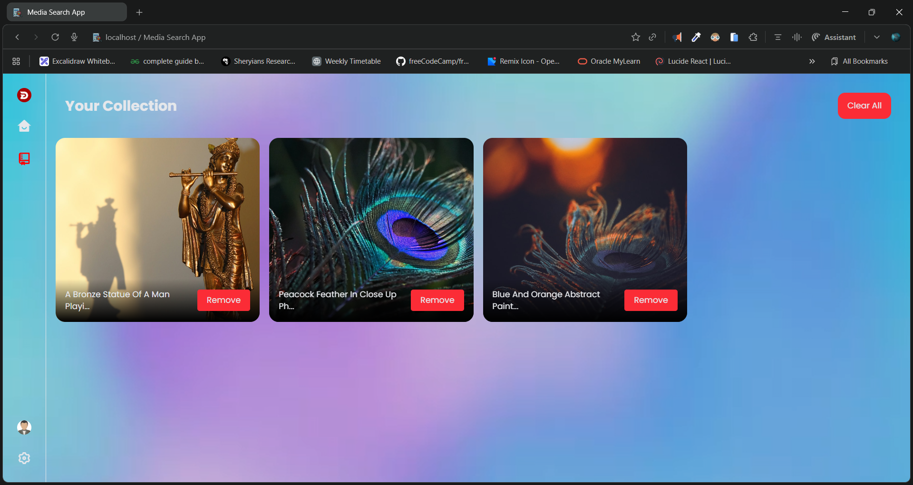

# 🎬 Media Search App (React + Redux)

A modern **Media Search Application** built with **React and Redux** that allows users to search **images, videos, and GIFs**, save them to a personal collection, and persist data using **localStorage**.

This project focuses on **real-world React architecture**, **state management**, and **API-driven UI**, not toy examples.

🔗 **Live Demo**:
👉 [https://react11mediasearch.netlify.app/](https://react11mediasearch.netlify.app/)

📦 **Source Code**:
👉 [https://github.com/Dileep-kumawat/Media-search-App-using-React-and-Redux](https://github.com/Dileep-kumawat/Media-search-App-using-React-and-Redux)

---

## 🚀 Features

* 🔍 **Search Media**

  * Search **Images**, **Videos**, and **GIFs** via external API
  * Dynamic search with category switching

* 🧠 **Redux State Management**

  * Centralized state for:

    * Search results
    * Saved media
    * Active media type
  * Clean Redux flow (actions → reducers → store)

* 💾 **Persistent Storage (localStorage)**

  * Saved items persist even after page refresh
  * Redux state synced with browser storage

* ❤️ **Save & Remove Media**

  * Save any media item to your personal collection
  * Remove individual items or clear everything at once

* 📁 **Collection Page**

  * Dedicated section to manage saved media
  * Instant UI updates using Redux

* 🎨 **Modern UI**

  * Gradient-based clean design
  * Card-based media layout
  * Responsive and user-friendly interface

* ⚡ **Fast & Optimized**

  * Efficient rendering with React hooks
  * Minimal re-renders using Redux selectors

---

## 🛠️ Tech Stack

* **Frontend**: React (Hooks)
* **State Management**: Redux
* **Styling**: CSS / Modern UI patterns
* **Storage**: Browser `localStorage`
* **API**: Media Search API (Images / Videos / GIFs)
* **Deployment**: Netlify

---

## 🧩 Project Structure

```
Media-search-App/
│
├── src/
│   ├── components/
│   ├── redux/
│   │   ├── actions/
│   │   ├── reducers/
│   │   └── store.js
│   ├── pages/
│   ├── utils/
│   └── App.jsx
│
├── public/
├── package.json
└── README.md
```

---

## 📸 Preview

### 🔍 Media Search Page



### ❤️ Saved Collection Page



---

## 🎥 Demo Video

▶️ **Project Walkthrough**
[Click here to watch the demo](https://youtu.be/Rna0XSV1oyk)

---

## 🧠 What This Project Demonstrates

* How **Redux actually works** (not just `useState` everywhere)
* How to structure a **scalable React app**
* How to integrate and manage **API-driven data**
* How to persist application state using **localStorage**
* How to build **real, usable UI**, not tutorial clones

---

## 👨‍💻 Author

Made with ❤️ by **Dileep kumawat** - Full-Stack Developer (MERN).
- GitHub: [https://github.com/Dileep-kumawat](https://github.com/Dileep-kumawat)
- 📧 [dileepkumawat525@gmail.com](mailto:dileepkumawat525@gmail.com)
- 🔗 [LinkedIn](https://www.linkedin.com/in/dileep-kumawat/)

---

## 📜 License

MIT © 2026